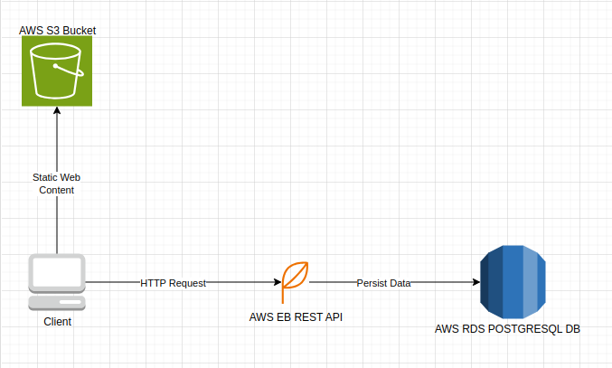

## Application Dependencies

1. Frontend

- Built with Angular and TypeScript
- Hosted on AWS S3 for serving static files.

2. Backend
- Built with Node.js, Express.js and TypeScript
- Hosted on AWS Elastic Beanstalk.
- Communicates with AWS RDS PostgreSQL.
- Tested with Supertest, Jasmine