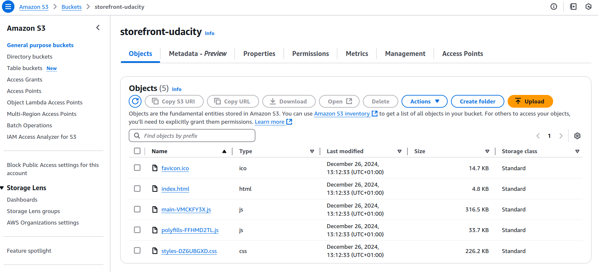
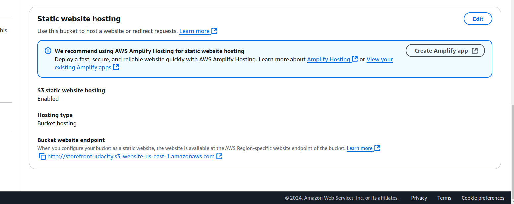
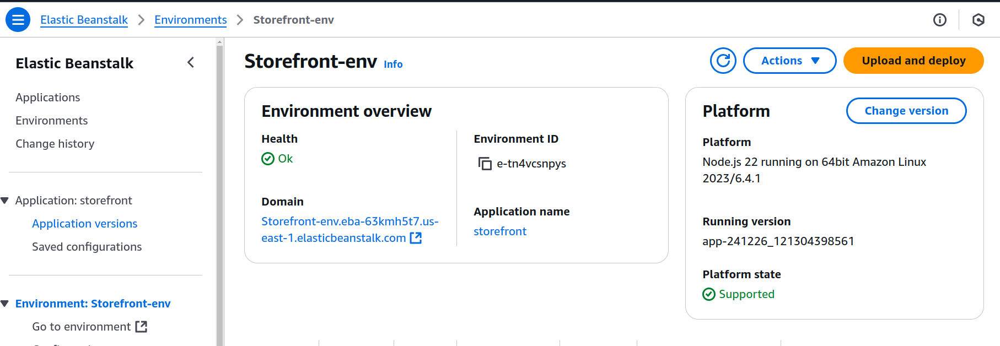
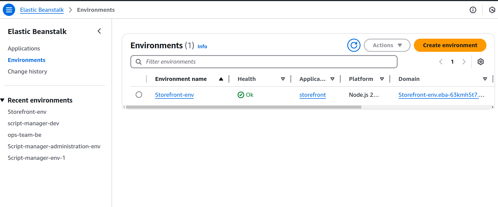
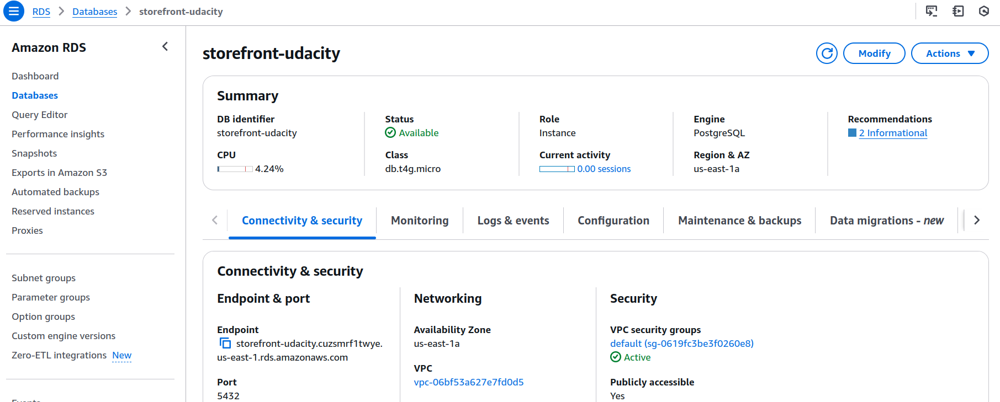

## Infrastructure

This document outlines the infrastructure setup for the application. The application is divided into three major components:

1. Frontend: Angular app hosted on AWS S3. Users access the angular app via a public URL.
2. Backend: Node.js + Express API hosted on AWS Elastic Beanstalk. The frontend communicates with the backend via RESTful APIs over HTTP.
3. Database: PostgreSQL database hosted on AWS RDS.

### Components
1. AWS S3

    Hosts the static files for the Angular frontend.
    
    http://storefront-udacity.s3-website-us-east-1.amazonaws.com

    

    

2. AWS Elastic Beanstalk

    Hosts the Node.js backend API.

    http://storefront-env.eba-63kmh5t7.us-east-1.elasticbeanstalk.com/

    

    

3. AWS RDS (Relational Database Service)

    Provides the PostgreSQL database for storing application data. Accessible only by Elastic Beanstalk instances via Security Groups.

    