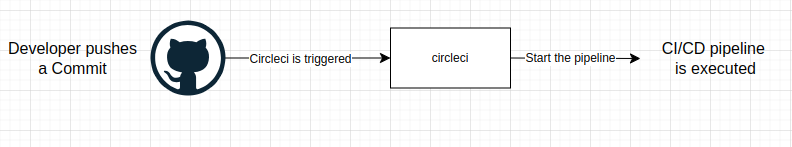
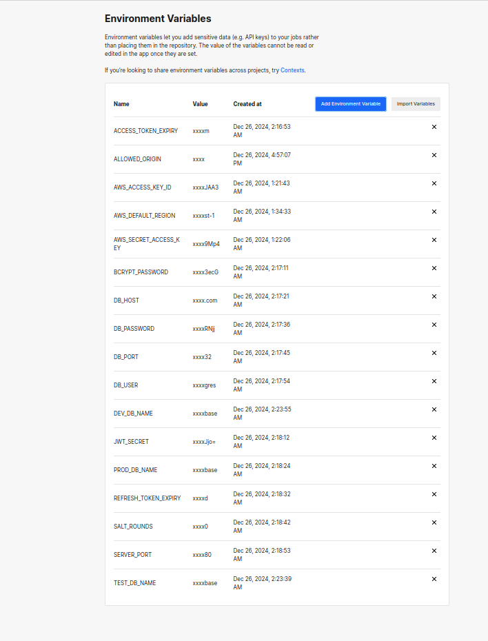

## Pipeline

The CI/CD pipeline for this project is built using CircleCI. The pipeline automates the build and deployment processes for both the frontend and backend.

### Steps in the Pipeline

1. Install Node
2. Checkout
3. AWS CLI Setup
4. AWS EB Setup
5. Install Dependencies for Frontend
6. Install Dependencies for Backend
7. Build Frontend
8. Build Backend
9. Deploy Frontend
10. Deploy Backend

### CircleCI environment variables

